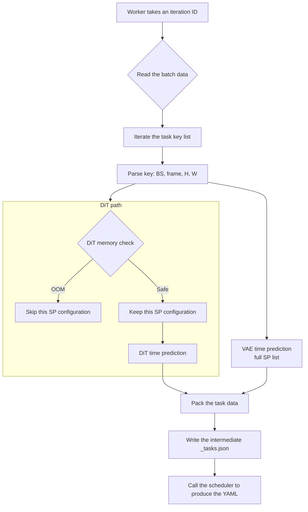

# SchedulePool: core logic notes

**File**: SchedulePool.py  
**Responsibility**: a concurrent task pool bridging "training iteration data" and
the "scheduling algorithm". It reads training tasks, uses the cost model to
predict their performance at each degree of parallelism, filters out the
configurations that would OOM, and finally feeds the cleaned data to the
Scheduler to produce a YAML plan.

---

## 1. Method reference

| Method | Kind | Purpose | Key logic / notes |
|--------|------|---------|-------------------|
| `__init__` | Init | Set up the environment: load config, start worker threads, initialise the predictors | - initialises IterationLogParser (simulating the DataLoader)   - initialises the VAE/DiT time predictors   - **important**: initialises DitMemoryPredictor for the OOM check |
| `_start_workers` | Internal | Start the background daemon threads | Starts num_workers threads to consume the queue |
| `_worker` | Internal | Consumer loop: take an iteration ID off the queue and process it | Catches exceptions so one failed task cannot bring down the whole pool |
| `process_one` | Core | Process every task of one iteration and build the scheduler input | 1. parse the task key (BS, frame, H, W)   2. DiT memory filter: drop SP configurations that would OOM   3. time prediction: compute DiT/VAE execution time   4. export JSON (debug) and call scheduler.schedule |
| `submit` | API | Submit an iteration ID to the queue | Producer entry point |
| `get` | API | Wait for and return the generated schedule YAML path | Supports blocking (block=True) and a timeout |
| `close` | API | Shut the thread pool down gracefully | Sends a None poison pill to stop every worker |

---

## 2. Key flow (process_one)

`process_one` is the most involved method; it determines what the planner is fed.

    
## 3. Predictors and cost-model details

`process_one` treats DiT and VAE differently:

### DiT (Diffusion Transformer)
- **Memory limit**: strict. `self.dit_memory_predictor.get_available_sp_list`
  must be consulted first.
- **SP list**: at large resolutions or long sequences, low SP (e.g. SP=1) is
  dropped for OOM and **never becomes a scheduling candidate**.
- **Time prediction**: `DitPredictor`.

### VAE (Variational Autoencoder)
- **Memory limit**: loose. No memory filter is applied in the current code.
- **SP list**: the full set from `cost_model_config.DIT_MODEL_SP_MAP` plus SP1.
  The VAE is assumed to run at every SP (or to avoid OOM through tiling).
- **Time prediction**: `VaeSystemPredictor`.

## 4. Outputs

For each iteration N the module writes two files under `output_dir`:

- **`schedule_N_tasks.json`**
    - **Purpose**: intermediate debugging file.
    - **Contents**: the candidate list for every task in this step (how long the
      task takes at SP=1, at SP=8, and so on).

- **`schedule_N.yaml`**
    - **Purpose**: the final product, read by the runtime executor.
    - **Contents**: the decision after planner optimisation (genetic algorithm /
      A*) — for each task, the time point, GPU group and SP it was assigned.

## 5. Troubleshooting

1. **`"Warning: No available SP found for DiT..."`**
    - **Cause**: the input image/video is large enough that `DitMemoryPredictor`
      expects an OOM even at the highest SP.
    - **Fix**: check the OOM threshold files referenced by `cost_model_config`,
      or check whether the input resolution is unexpected.

2. **A worker appears to hang**
    - **Cause**: `schedule()` is taking too long internally (for example too
      many genetic-algorithm generations), or a deadlock.
    - **Diagnosis**: check whether the `_tasks.json` was produced. If it exists
      but no YAML followed, the run is stuck inside the scheduler.
