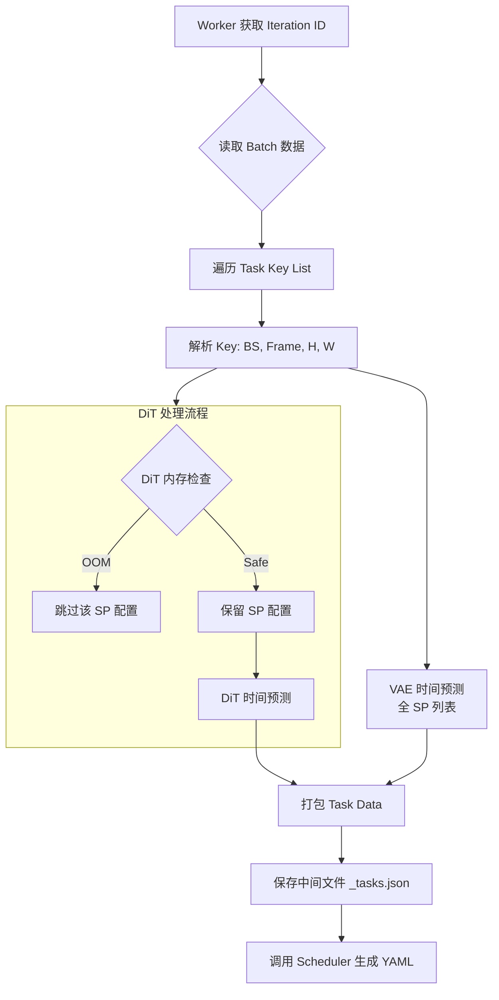

# SchedulePool 核心逻辑备忘录

**文件位置**: SchedulePool.py  
**核心职责**: 作为一个并发任务池，负责衔接“训练迭代数据”与“调度算法”。它读取训练任务，利用 Cost Model 预测其在不同并行度下的性能，过滤掉 OOM 的配置，最后将清洗好的数据喂给 Scheduler 生成 YAML 计划。

---

## 1. 核心方法速查表

| 方法名 | 类型 | 作用简述 | 关键逻辑/备注 |
|--------|------|----------|-------------|
| `__init__` | Init | 初始化环境：加载配置、启动工作线程、初始化预测器 | - 初始化 IterationLogParser (模拟DataLoader)   - 初始化 VAE/DiT 时间预测器   - **重点**: 初始化 DitMemoryPredictor 用于 OOM 检查 |
| `_start_workers` | Internal | 启动后台守护线程 | 默认启动 num_workers 个线程处理队列任务 |
| `_worker` | Internal | 消费者循环：从队列获取 iteration ID 并处理 | 包含异常捕获，确保单个任务失败不会搞崩整个 Pool |
| `process_one` | Core逻辑核心 | 处理单个迭代的所有任务，生成调度输入 | 1. 解析任务 Key (BS, Frame, H, W)   2. DiT 内存过滤：剔除 OOM 的 SP 配置   3. 时间预测：计算 DiT/VAE 的执行耗时   4. 导出 JSON (Debug) 并调用 scheduler.schedule |
| `submit` | API | 提交一个 Iteration ID 到队列 | 生产者入口 |
| `get` | API | 等待并获取生成的 Schedule YAML 路径 | 支持阻塞 (block=True) 和超时等待 |
| `close` | API | 优雅关闭线程池 | 发送 None 信号毒丸 (Poison Pill) 停止所有 Worker |

---

## 2. 关键逻辑流程 (process_one)

`process_one` 是最复杂的方法，它决定了喂给 Planner 的数据长什么样。

    
## 3. 预测器与 Cost Model 细节

在 `process_one` 中，DiT 和 VAE 的处理策略不同：

### DiT (Diffusion Transformer)
- **内存限制**: 严格。必须先调用 `self.dit_memory_predictor.get_available_sp_list`。
- **SP 列表**: 如果是大分辨率/长序列，低 SP (如 SP=1) 会因为 OOM 被剔除，**不会进入调度候选项**。
- **时间预测**: 使用 `DitPredictor`。

### VAE (Variational Autoencoder)
- **内存限制**: 宽松。目前代码未应用内存过滤器。
- **SP 列表**: 使用 `cost_model_config.DIT_MODEL_SP_MAP` 中的全集 + SP1。假设 VAE 总是能在所有 SP 下运行（或通过 Tiling 解决 OOM）。
- **时间预测**: 使用 `VaeSystemPredictor`。

## 4. 输出产物

对于每个 Iteration N，该模块会在 `output_dir` 生成两个文件：

- **`schedule_N_tasks.json`**
    - **用途**: 中间调试文件。
    - **内容**: 包含该 Step 所有 Task 的候选列表（即：这个 Task 如果用 SP=1 跑要多久，用 SP=8 跑要多久）。

- **`schedule_N.yaml`**
    - **用途**: 最终产物，被 Runtime Executor 读取。
    - **内容**: 经过 Planner (遗传算法/A*) 优化后的最终决策（每个 Task 具体被分配到了哪个时间点、哪组 GPU、哪个 SP）。

## 5. 常见问题 (Troubleshooting)

1. **`"Warning: No available SP found for DiT..."`**
    - **原因**: 输入的 Image/Video 规格太大，导致 `DitMemoryPredictor` 认为即便在最大 SP 下也会 OOM。
    - **解决**: 检查 `cost_model_config` 中的 OOM 阈值文件，或者检查输入数据的分辨率是否异常。

2. **Worker 假死/卡住**
    - **原因**: `schedule()` 函数内部计算太久（例如遗传算法迭代次数过多），或者死锁。
    - **排查**: 查看生成的 `_tasks.json` 是否存在，如果存在但没有 YAML，说明卡在 Scheduler 内部。